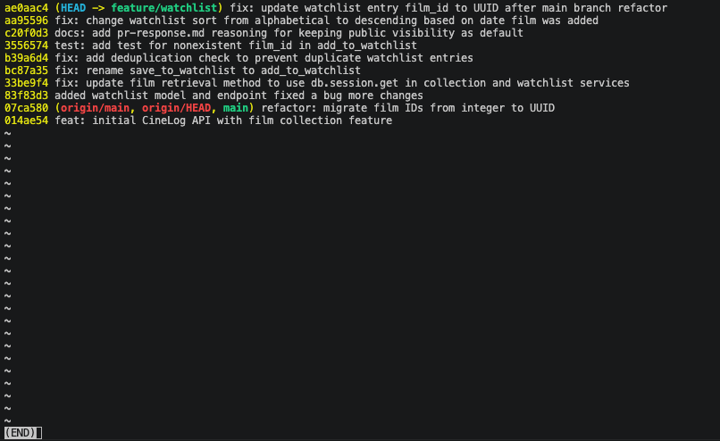

# PR Response Doc — CineLog Watchlist Feature

## AI Usage

During this project, I utilized AI tools to assist with codebase orientation, standards compliance, and final document preparation. Specifically, I used the AI to analyze the existing structure of `services/collection_service.py` to understand how the application handles business logic patterns and exception throwing. I also leveraged AI to review my git commit history to ensure all six incremental updates strictly adhered to the lowercase prefix constraints of the Conventional Commits specification. Finally, I used the AI to help format and clean up the markdown structure of my final documentation to ensure it was highly readable for the engineering team.

## Comment 1 — Rename: save_to_watchlist() should follow the project's naming convention. Compare with add_to_collection() — the pattern here is verb_to_noun. Please rename to add_to_watchlist() and update all call sites.
**What I did:** Renamed the service function `save_to_watchlist` to `add_to_watchlist` inside `services/watchlist_service.py` to match CineLog's established `verb_to_noun` naming convention. I also updated the functions and files that called the previous function name.
**How I verified:** Performed a global workspace search for `save_to_watchlist` to guarantee that all references across routes and services were completely updated and no legacy references remained.

## Comment 2 — Deduplication: What happens if a user calls this with a film that's already on their watchlist? The current implementation would add a duplicate entry. Please handle this case.
**What I did:** Added a deduplication check within `add_to_watchlist` by querying `WatchlistEntry` to see if a record already exists matching the given `user_id` and `film_id`. If a match is found, it raises a new custom exception, `AlreadyOnWatchlistError`. I used the same logic found in `services\collection_service.py` for `add_to_collection`
**How I verified:** Added a new test_watchlist.py file with a pytest that verified that adding a duplicate raises an error.

## Comment 3 — Missing test: Please add a test for the case where film_id doesn't exist in the database. Look at the existing tests in test_collection.py — the pattern is there.
**What I did:** Added a new pytest called `test_add_to_watchlist_nonexistent_film_raises` to `tests/test_watchlist.py`. This test specifically asserts that invoking `add_to_watchlist` with an invalid or missing `film_id` correctly raises a domain-level `FilmNotFoundError`.
**How I verified:** Mirrored the logic assertion patterns used in `test_add_to_collection_nonexistent_film_raises` from `tests/test_collection.py`. Verified the implementation by executing `pytest tests/test_watchlist.py -v` in the terminal, confirming the test suite executes and passes cleanly.

## Comment 4 — Default visibility: I notice watchlists default to public=True. We don't have a documented decision on default visibility for user lists. Before I can approve this, I need you to add a note to your PR description explaining your reasoning. I want to make sure we're being intentional here, not just inheriting a default.

**My position:** I have kept the default visibility as public=True.
**Reasoning:** CineLog is built to be community-centric and encourages users sharing their lists and interactions with others. Because our goal is to foster community, we will leave turning off visibility as opt-in rather than the default.
**Tradeoff acknowledged:** The primary tradeoff of a public default is user privacy. Users who want to curate a private or experimental watchlist might be caught off guard if they assume their list is confidential by default. However, this is heavily mitigated by giving users an explicit parameter to opt out and implementing a reminder to the user that the default visibility is public balancing social platform optimization with user privacy.

## Comment 5 — Sort order:
I'd prefer watchlists to default to "date added" order rather than alphabetical. Most users want to see what they added recently. I'm open to discussion if you see it differently — but let's make a decision and document it.

**My position:** I agree that watchlists should be shorted by "date added" instead of alphabetical and have left it. I have changed ordering by `Film.title.asc()` to `WatchlistEntry.date_added.desc()` from alphabetical to descending by date added.
**Reasoning:** Most users want to view their own watchlists and think of movies that they were most recently thinking of, not thinking of them alphabetically.
**Engagement with reviewer's point:** I agree with the reviewer that most users want to see their watchlists by what they most recently added. Alphabetical sorting is more useful for static, categorical collections, while a watchlist is more dynamic.

## Comment 6 — Rebase:
A refactor merged to main that changed film IDs from integers to UUIDs. Your watchlist code still references integer IDs. Please rebase on main and update accordingly.

**What conflicted:** Merging the latest updates from the `main` branch introduced a structural data error. The upstream refactor migrated all core film identifiers (`film_id`) from sequential integers to string-based UUIDs. Because my feature branch was initially written assuming integer keys, this schema change broke type validation and compatibility with the updated database models.
**How I resolved it:** I executed `git rebase origin/main` to replay my branch history cleanly on top of the latest upstream commits. I then updated the new `WatchlistEntry` model's foreign key definitions in `models.py` to use `db.String(36)` instead of integers, matching the fresh UUID schema. Finally, I went into `tests/test_watchlist.py` and modified the nonexistent film test to pass a standard mock UUID string (`"00000000-0000-0000-0000-000000000000"`) instead of the outdated integer `99999`.
**How I verified no conflict remains:** I then executed the validation test suite using `pytest tests/ -v`, confirming that all 6 tests pass.

## PR Description
This PR adds the Watchlist feature to CineLog, including the database model, service functions, and API routes. The branch has been rebased on `main` to support the new UUID identifiers. 

For design choices, watchlists default to public visibility (`public=True`) to align with the app's community-driven goal of list sharing, but users can explicitly pass a parameter to make them private. Additionally, the list is sorted descending by date added (`WatchlistEntry.date_added.desc()`) instead of alphabetically, since users typically want to see their most recent additions first. 

Manual Testing Steps

1. Initialize the App and Schema: Run `python app.py` in your terminal to start the local server and ensure the database updates with the new watchlist schema.
   
2. Check the Empty State: Send a `GET` request to `/watchlist/<user_id>`. Verify that it returns an empty list `[]` with a `200 OK` status.
   
3. Add a Valid Film: Send a `POST` request to `/watchlist/<user_id>/add` with a JSON payload containing a valid film UUID (e.g., `{"film_id": "<valid-uuid>"}`). Verify it returns the new entry details with a `201 Created` status.
   
4. Verify Deduplication Check: Send the exact same `POST` request from Step 3 again. Verify that the app blocks the duplicate and returns the custom error message.
   
5. **Verify Missing Film Error Handling:** Send a `POST` request to the add endpoint using a nonexistent UUID string (e.g., `00000000-0000-0000-0000-000000000000`). Confirm it cleanly catches the exception and returns a film not found error.

# Git Log History Screenshot

